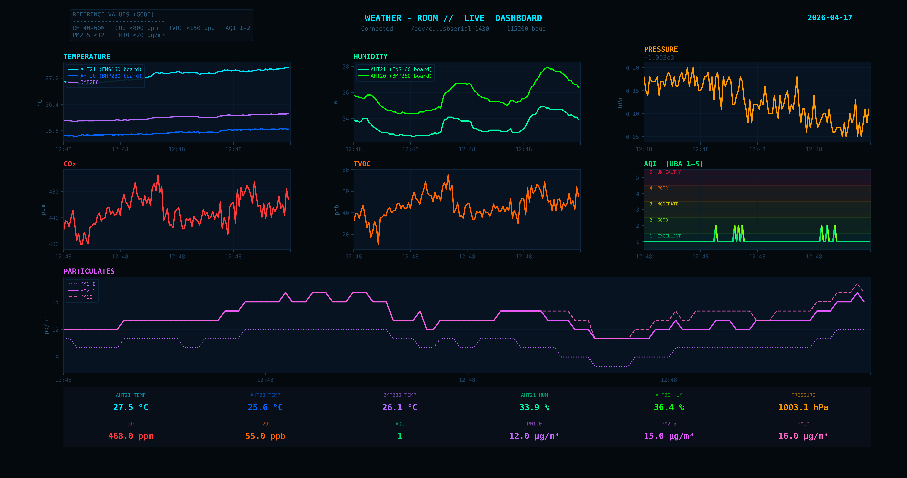
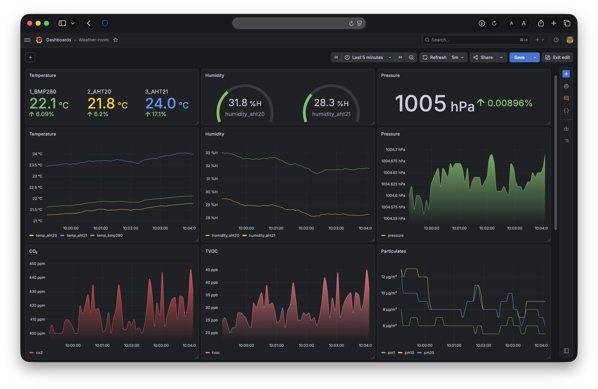
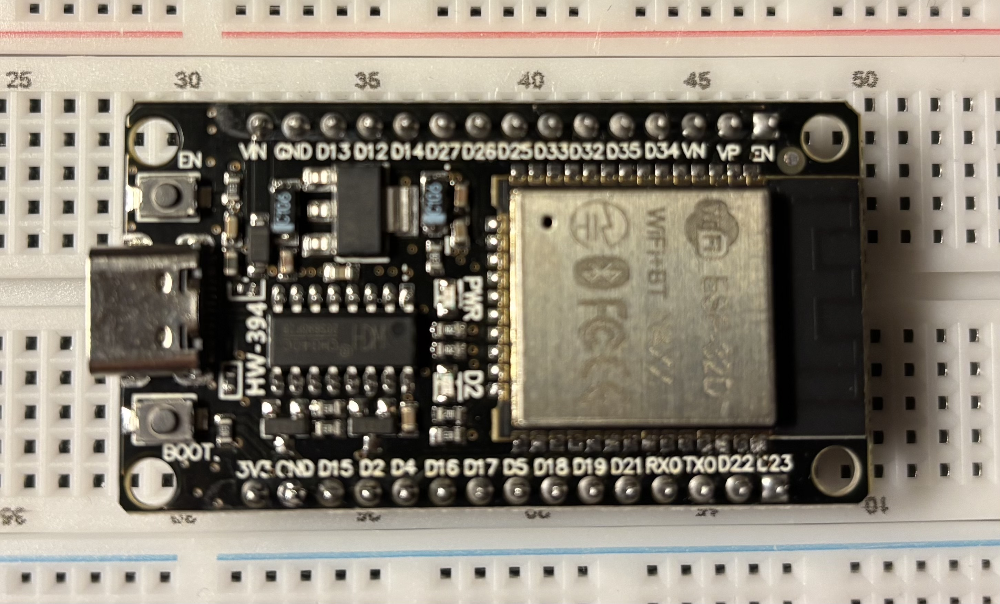
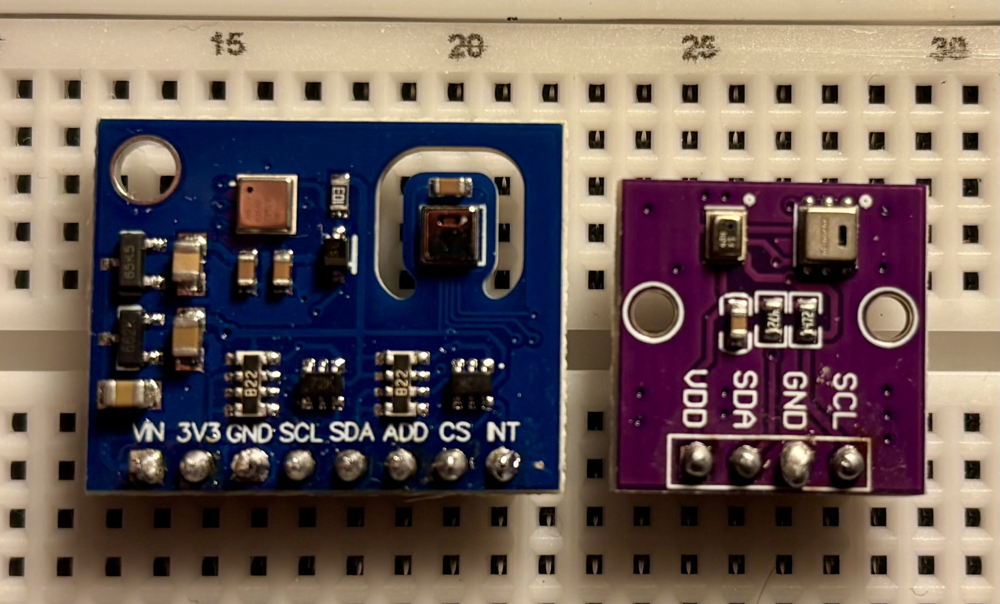
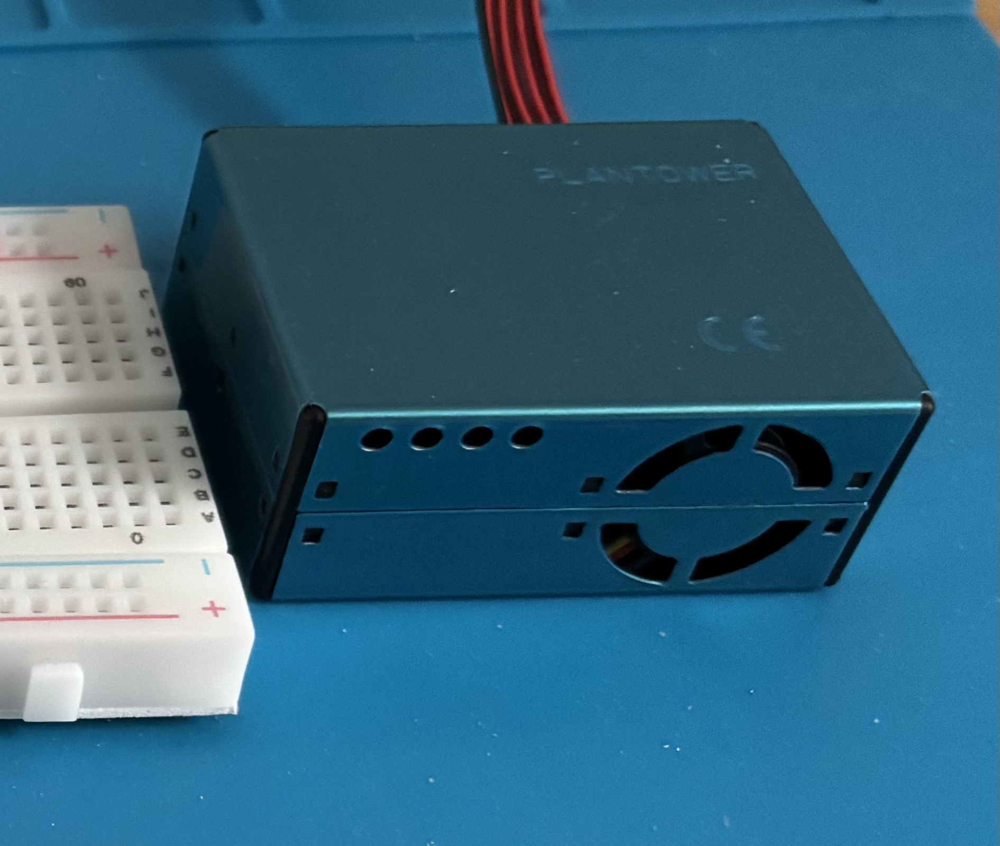
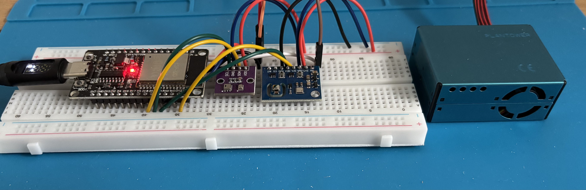

# weather-room

<table>
<tr>
<td align="center" width="50%">

<br><sub>Python dashboard</sub>
</td>
<td align="center" width="50%">

<br><sub>Grafana dashboard</sub>
</td>
</tr>
</table>

*Live Python dashboard reading from the ESP32 in real time.*

A DIY indoor air quality monitor built on an ESP32. It reads temperature, humidity, pressure, CO2, TVOC, AQI, and particulate matter (PM1.0, PM2.5, PM10) from a set of sensors wired to a breadboard, streams all data over Serial, and visualizes everything in a live Python dashboard.

---

## Hardware

| Component | What it measures |
|---|---|
| ESP32 30-pin (HW-394) | WiFi microcontroller, runs the firmware |
| AHT21 (on ENS160 board) | Temperature, humidity |
| ENS160 | CO2 (eCO2), TVOC, AQI |
| AHT20 (on BMP280 board) | Temperature, humidity |
| BMP280 | Pressure, altitude, temperature |
| PMS5003 (Plantower) | PM1.0, PM2.5, PM10 particulates |

The AHT21 and AHT20 both measure temperature and humidity independently. The BMP280 also has a temperature sensor. Having three independent temperature sources is useful for cross-checking — see the thermal note below.

### Hardware photos

| | |
|---|---|
|  <br> ESP32 dev board |  <br> ENS160 + AHT21 and BMP280 + AHT20 boards |
|  <br> PMS5003 sensor |  <br> Quick setup |

---

## Wiring

### I2C Bus 1 — GPIO21 (SDA) / GPIO22 (SCL)

Blue board (ENS160 + AHT21). Pin labels as printed on the board:

| Board pin | Connect to | Notes |
|---|---|---|
| VIN | — | Do not connect |
| 3V3 | 3.3V | Power for both ENS160 and AHT21 |
| GND | GND | |
| SCL | GPIO22 | |
| SDA | GPIO21 | |
| ADD | GND | Sets ENS160 I2C address to 0x52 |
| CS | — | SPI chip select — leave unconnected (I2C mode) |
| NT | — | Interrupt — leave unconnected |

### I2C Bus 2 — GPIO18 (SDA) / GPIO19 (SCL)

Purple board (BMP280 + AHT20). Pin labels as printed on the board:

| Board pin | Connect to | Notes |
|---|---|---|
| VDD | 3.3V | Power for both BMP280 and AHT20 |
| SDA | GPIO18 | |
| GND | GND | |
| SCL | GPIO19 | |

### UART — GPIO25 (RX)

| Board pin | Connect to | Notes |
|---|---|---|
| PIN1 (VCC) | VIN (5V) | PMS5003 requires 5V |
| PIN2 (GND) | GND | |
| PIN5 (TX) | GPIO25 | ESP32 RX |
| All others | — | Leave unconnected |

### I2C addresses 

| Address | Sensor | Bus |
|---|---|---|
| 0x38 | AHT21 | Bus 1 |
| 0x52 | ENS160 | Bus 1 |
| 0x38 | AHT20 | Bus 2 |
| 0x77 | BMP280 | Bus 2 |

### Why two I2C buses

AHT21 and AHT20 both default to address 0x38 and have no way to change it. Putting them on the same bus causes an address conflict — only one would respond. Splitting them onto separate buses is the clean solution. All other sensors have unique addresses and could share a bus, but keeping each board isolated makes the wiring cleaner and debugging easier.

---

## Thermal note

The AHT21 is physically located on the same PCB as the ENS160. The ENS160 generates heat during normal operation which raises the local board temperature and causes the AHT21 to read approximately 2-3°C higher than actual room temperature. This is a placement issue, not a sensor defect — the AHT21 is intrinsically the more accurate sensor per spec (newer revision than AHT20), but its readings are thermally biased.

In practice, AHT20 and BMP280 agree within 0.5°C and are more representative of actual room temperature.

For ENS160 compensation (which requires live temperature and humidity as input per the datasheet), AHT20 values are used since they are thermally unbiased.

All values from all sensors are logged raw with no correction applied. Any calibration offsets should be applied at the analysis layer.

---

## Firmware

Written in Arduino C++ for the ESP32. The sketch is in `arduino/weather_room.ino`.

Uses the following libraries — install all via Arduino IDE Library Manager:

- `Adafruit BMP280` — BMP280 pressure sensor
- `Adafruit AHTX0` — AHT20 and AHT21
- `ENS160 - Adafruit Fork` (ScioSense_ENS160.h) — ENS160 air quality sensor
- `PMS` by Mariusz Kacki — PMS5003 particle sensor

### Setup

1. Install [Arduino IDE](https://www.arduino.cc/en/software)
2. Add ESP32 board support via Boards Manager (search `esp32` by Espressif)
3. Install the four libraries above via Library Manager
4. Open `arduino/weather_room.ino`
5. Select board: `ESP32 Dev Module`
6. Set upload speed to `115200` if upload issues occur
7. Upload

### What the firmware does

- Initializes both I2C buses and UART on boot
- Runs a 15 second ENS160 warmup before starting the main loop
- Reads all sensors every 2 seconds
- Prints everything to Serial at 115200 baud in a structured format
- Performs a sanity check on temperature readings (skips the cycle if AHT values are out of range, which can happen briefly on boot)
- Does not store, average, or modify any sensor values

---

## Firmware — WiFi version

Use `arduino/weather_room_wifi_template.ino` as the public template, then create a local `arduino/weather_room_wifi.ino` with local credentials.

Quick start:

```bash
cp arduino/weather_room_wifi_template.ino arduino/weather_room_wifi.ino
```

The WiFi sketch does everything the serial version does — same sensors, same 2-second loop, same raw-data-only philosophy — and additionally connects to WiFi on boot and POSTs sensor readings to InfluxDB every 2 seconds using HTTP and InfluxDB Line Protocol.

### WiFi and InfluxDB configuration

At the top of the sketch there is a configuration block. Fill these in before uploading:

```cpp
#define WIFI_SSID    "WIFI_NETWORK_NAME"
#define WIFI_PASS    "WIFI_PASSWORD"
#define INFLUX_URL   "http://LOCAL_MAC_IP:8086"  // e.g. http://192.168.1.42:8086
#define INFLUX_TOKEN "INFLUXDB_API_TOKEN"
#define INFLUX_ORG   "weatherroom"
#define INFLUX_BUCKET "sensors"
```

Find the Mac's current IP with:

```bash
ipconfig getifaddr en0
```

Note that the Mac IP can change between reboots. To avoid reflashing, assign a static local IP in the router's DHCP settings.

### Offline behavior

If WiFi is offline or the POST fails, the firmware skips that write silently and continues reading sensors. Serial output is unaffected — the dashboard still works regardless of network state.

---

## Python dashboard

A live scrolling visualization that reads from the ESP32 Serial port and plots all metrics in real time.

### Setup

```bash
cd weather-room
python3 -m venv .venv
source .venv/bin/activate
pip install -r requirements.txt
```

### Run

```bash
source .venv/bin/activate
python dashboard.py
```

Make sure Arduino IDE Serial Monitor is closed before running — the port can only be used by one process at a time.

### Configuration

At the top of `dashboard.py`:

```python
SERIAL_PORT = "/dev/cu.usbserial-1430"  # change to the desired port
BAUD_RATE   = 115200
MAX_POINTS  = 120                        # number of points shown (4 min at 2s interval)
UPDATE_MS   = 505                        # dashboard refresh rate (ms)
```

Find the port in Arduino IDE under Tools → Port.

### What it shows

- Temperature — all three sources overlaid (AHT21, AHT20, BMP280)
- Humidity — AHT21 and AHT20 overlaid
- Pressure — BMP280
- CO2, TVOC, AQI — ENS160
- Particulates — PM1.0, PM2.5, PM10 overlaid
- Latest values bar at the bottom with live readouts for all 13 metrics

### Dashboard screenshot

<p align="center">
  
</p>

---

## Project structure

```
weather-room/
├── arduino/
│   ├── weather_room.ino                # ESP32 firmware (serial version)
│   ├── weather_room_wifi_template.ino   # WiFi template 
│   └── weather_room_wifi.ino            # local WiFi file with real creds (gitignored)
├── docs/
│   └── assets/                         # screenshots and hardware photos
├── docker/
│   ├── docker-compose.yml              # starts InfluxDB and Grafana
│   └── .env.template                   # local env template 
├── dashboard.py               # live Python dashboard
├── requirements.txt           # Python dependencies
├── LICENSE
├── .gitignore
└── README.md
```

---

## InfluxDB + Grafana

Persistent time-series storage and historical dashboards running locally in Docker. Requires Docker Desktop to be running.

### Start the stack

First-time setup:

1. Copy the template to a local env file.
2. Put the chosen InfluxDB password in the local file.
3. Start Docker from the `docker` folder.

```bash
cd docker
cp .env.template .env
docker compose up -d
```

- InfluxDB: [http://localhost:8086](http://localhost:8086) — username `admin`, password from the local `docker/.env`
- Grafana: [http://localhost:3000](http://localhost:3000) — first login is `admin` / `admin`, then change it after sign-in

On the first InfluxDB startup, Docker reads the password from `docker/.env` and uses it to initialize the database.

Both containers are configured with `restart: unless-stopped`, so they come back up automatically when the Mac restarts.

### Data storage

Data is stored in Docker named volumes and persists across container restarts and `docker compose down`. No retention policy is set — data is kept indefinitely.

Check the current data size:

```bash
docker exec influxdb du -sh /var/lib/influxdb2/engine
```

Stop the stack (volumes are preserved):

```bash
docker compose down
```

### Grafana datasource

Grafana connects to InfluxDB using Flux. When adding the datasource in Grafana, set the URL to `http://influxdb:8086` (the Docker service name, not localhost) and select Flux as the query language.

### Grafana screenshot

<p align="center">
  
</p>

### Flux queries for dashboard panels

All panels query the `air_quality` measurement in the `sensors` bucket.

#### Temperature (AHT21, AHT20, BMP280 overlaid)

```flux
from(bucket: "sensors")
  |> range(start: v.timeRangeStart, stop: v.timeRangeStop)
  |> filter(fn: (r) => r._measurement == "air_quality")
  |> filter(fn: (r) => r._field == "temp_aht21" or r._field == "temp_aht20" or r._field == "temp_bmp280")
```

#### Humidity (AHT21 and AHT20 overlaid)

```flux
from(bucket: "sensors")
  |> range(start: v.timeRangeStart, stop: v.timeRangeStop)
  |> filter(fn: (r) => r._measurement == "air_quality")
  |> filter(fn: (r) => r._field == "humidity_aht21" or r._field == "humidity_aht20")
```

#### Pressure

```flux
from(bucket: "sensors")
  |> range(start: v.timeRangeStart, stop: v.timeRangeStop)
  |> filter(fn: (r) => r._measurement == "air_quality")
  |> filter(fn: (r) => r._field == "pressure")
```

#### Altitude

```flux
from(bucket: "sensors")
  |> range(start: v.timeRangeStart, stop: v.timeRangeStop)
  |> filter(fn: (r) => r._measurement == "air_quality")
  |> filter(fn: (r) => r._field == "altitude")
```

#### CO2

```flux
from(bucket: "sensors")
  |> range(start: v.timeRangeStart, stop: v.timeRangeStop)
  |> filter(fn: (r) => r._measurement == "air_quality")
  |> filter(fn: (r) => r._field == "co2")
```

#### TVOC

```flux
from(bucket: "sensors")
  |> range(start: v.timeRangeStart, stop: v.timeRangeStop)
  |> filter(fn: (r) => r._measurement == "air_quality")
  |> filter(fn: (r) => r._field == "tvoc")
```

#### AQI (range 1–5)

```flux
from(bucket: "sensors")
  |> range(start: v.timeRangeStart, stop: v.timeRangeStop)
  |> filter(fn: (r) => r._measurement == "air_quality")
  |> filter(fn: (r) => r._field == "aqi")
```

#### Particulates (PM1.0, PM2.5, PM10 overlaid)

```flux
from(bucket: "sensors")
  |> range(start: v.timeRangeStart, stop: v.timeRangeStop)
  |> filter(fn: (r) => r._measurement == "air_quality")
  |> filter(fn: (r) => r._field == "pm1" or r._field == "pm25" or r._field == "pm10")
```

---

## Next steps

- Remote access via Tailscale
- ML anomaly detection on air quality time series